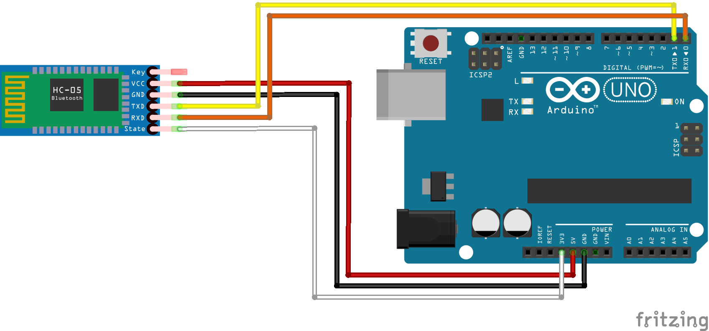

# Neste projeto testamos a comunicação do aparelho mobile

##  Basta subir o código e trocar o rx pelo tx conforme abaixo

<<<<<<< HEAD

=======


### 3- Reiniciar o modo padrão 

```O hc tem um modo padrão de configuração, para entrar nele, desconecte o cabo do arduino e aperte o botão do hc por 3 segundos e encaixe o cabo de energia de novo, se ele piscar lento está funcionando ```

### 4- Cheque pelo monitor serial

```Abra o monitor serial e teste se ele está funcionando conforme a imagem a baixo```


### Parabéns, funcionou
>>>>>>> a6f08e08ab6e57a7a0d50178e13f0d76c5c84c8b
